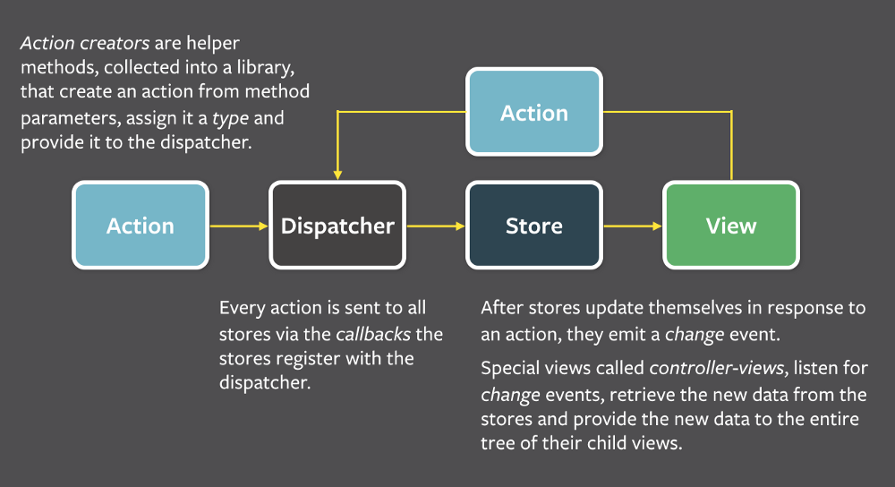
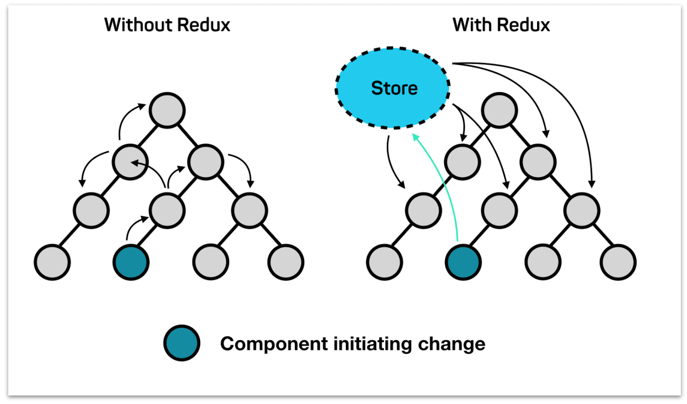

# 🎉 Dealer App 🎉

- Check out the dealer app in action [here](https://papillonbits.github.io/dealer/).

# 📚 Features

> As a car dealer, I want to browse the cars I have in stock and give purchase recommendations tailored to the needs of my customers. More specifically the following:

## 📗 Feature 1

> As a car dealer, I want to search for cars by year and make.

- 📖. Example:
  - Given the year 2018, I should get the Citroen C3 and Honda Fit.
  - Given the brand Citroën, I should get the Citroen C3 2018.
  - Leaving the search string blank should return a list of all cars.

## 📗 Feature 2

> As a car dealer, I want to be able to add new cars to my store.

- 📖. Example:
  - I will enter the car's model, make, version, year of release, price, fuel consumption, and annual maintenance cost. The car will show up in the results returned by feature 1.

## 📗 Feature 3

> As a car dealer, I want to recommend to my clients the car with the lowest total annual cost over a period of four (4) years.

- 📖. Given the price of fuel (€/L) and the expected distance to travel each month (km/month).
- 📖. Relevant car parameters are price of the car (€), fuel consumption (km/l), and annual maintenance cost.
- 📖. Example:
  - Given that I expect to travel 250 km each month for the next 4 years, and the expected price of fuel is 0.73 €/L,
    what is the ranking of cars according to their total annual cost?

# 📚 Concepts

> Sharing is caring. Following is a collection of concepts which any maintainer needs to master in order to gracefully maintain this project and scale its implementation along with its unit, integration and end-to-end tests.

## 📗 Application Architecture

> Flux based application architecture is applied using `redux`, `react-redux`, `redux-thunk` and `redux-logger`.

> Actions and thunks are dispatched to mutate application state in store.

> Components consume application state from store.

## 📗 Bootstrap

> Bootstrap is achieved using the following commands once having cloned this project:

- `npm run install-packages`
- `npm run bootstrap-release`

## 📗 Code Style

> Code style is applied using `husky` and `lint-staged` and consists of code linting, code formatting and file formatting.

### 📖. Code Linting

> Code linting is applied using `eslint` for JavaScript and `stylelint` for Sass.

### 📖. Code Formatting

> Code formatting is applied using `prettier` for both JavaScript and Sass.

### 📖. File Formatting

> File formatting is applied using `editorconfig`.

## 📗 Compiling

> Compiling is applied using `babel` for transpiling and `webpack` for bundling.

## 📗 Component Design

> Component design is applied using a custom hook for each component.

## 📗 Component Driven Development

> Component driven development is applied using atomic design and uses `@papillonbits/components` for atoms and molecules.

## 📗 CSS Architecture

> CSS architecture is applied using `@papillonbits/css` design tokens and CSS scoping is adressed using `CSS Modules` configured in `webpack` setup.

## 📗 Library

> Library is applied using `@papillonbits/library` for leveraging common generic functionality.

## 📗 Local Development

> Local development is achieved using the following commands once having bootstrapped this project:

- Starting
  - Run the following command in ❗️`packages/core`❗️ folder
    - `npm start`
- Linting and formatting
  - Run the following command in root folder
    - `npm run lint:format`
- Testing
  - Unit and integration testing (using `jest` snapshots)
    - Run the following commands in root folder
      - `npm run test`
      - `npm run test:tdd`
  - Integration testing (using `storybook` stories)
    - Run the following command in root folder
      - `npm run start-storybook`
  - Report coverage
    - Run the following command in root folder
      - `npm run report-coverage`

## 📗 Microsite

> Microsite is applied using `lerna`, `webpack` and `babel`.

## 📗 Monorepo

> Monorepo is applied using `lerna`.

## 📗 Rendering

> Rendering is applied using `react` and `react-dom`.

## 📗 Routing

> Routing is applied using `react-router` and `react-router-dom` for client side routing.

## 📗 Testing

> Testing is applied using `jest`, `enzyme`, `react-test-renderer`, `storybook` and `codecov`.
